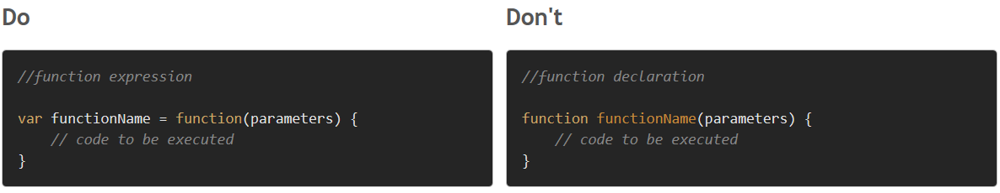
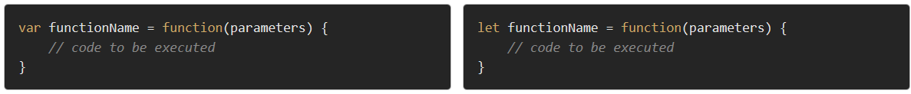
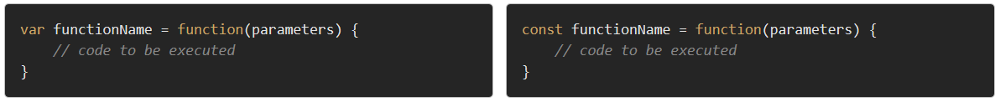
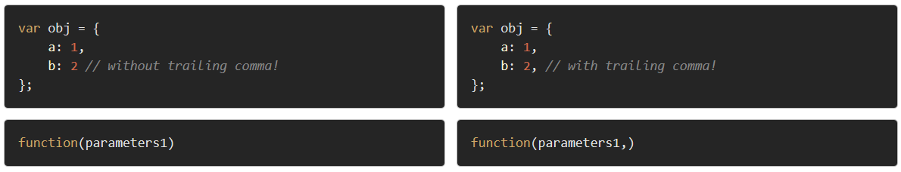
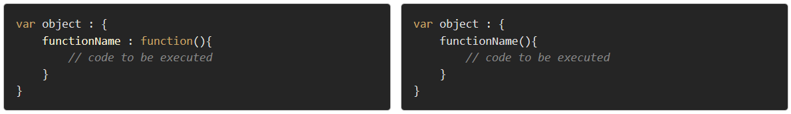
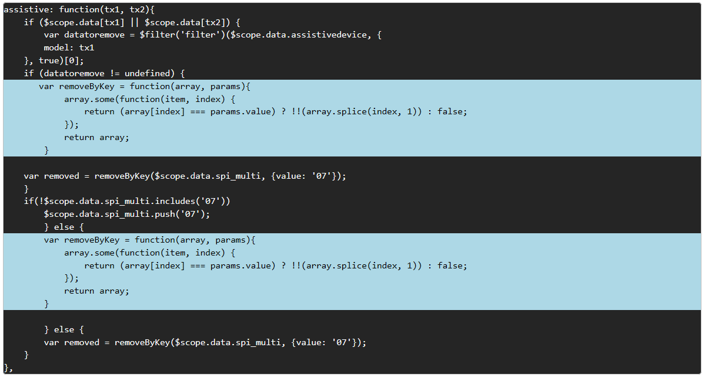
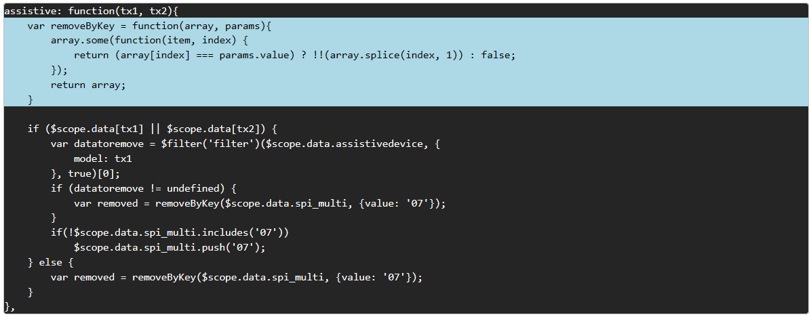

MINIFIER GUIDE
=======

This guide is to help you to use minifier properly to avoid an error during execution.

# Guide #1 (Do/Don't) 
## Function Declarations
Why we shoud do it?

The <i>minifier</i> assumes that the supplied JS is valid. If the concatenated JS files are invalid the <i>minifier</i> fails your execution.

Use <i>function expression</i> instead of <i>function declaration</i> method because there are several different ways that <i>function expressions</i> will become more useful than <i>function declarations</i>. 

- As closure
- As arguments to other functions
- As Immediately Invoked Function Expressions (IIFE). 

However the <i>fuction declaration</i> is invalid in minifier and not be executed.

&nbsp;
====

<i>var</i> and <i>let</i> are both used for function declaration in javascript but the difference between them is that <i>var</i> is function scoped and <i>let</i> is block scoped. However the <i>let</i> declaration is invalid in minifier and not be executed.

&nbsp;
====

<i>Const</i> just like <i>let</i> uses block scope, so it has all the properties of <i>let</i> besides the ability to prevent redeclaration of the variable. However like <i>let</i> declaration the <i>cons</i> declaration is also invalid in minifier and not be executed.

&nbsp;
====

*Trailing commas (sometimes called "final commas") can be useful when adding new elements, parameters, or properties to JavaScript code. However Trailing comma's in JS files prevent minification and not to executed to minifier.*

  
&nbsp;
====
<h3>Other</h3>

# Guide #2 (optional but highly recommended) 
## Refactor duplicated function with same code execution

<h2>Before</h2>

<h2>After</h2>

&nbsp;
====
<h3>Other</h3>

>Do not declare the JS on the Child state once it's already declared on the Parent state.

# Guide #3 (Important) 
>Don't forget to put semicolon (;) at the end of each JS factory as the error will not be visible upon the execution of the minifier. Though the error will reflect on the browser output and might affect the system's function.

